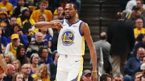
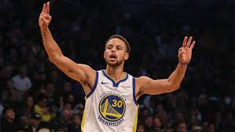
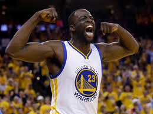
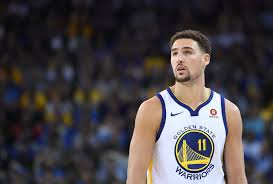
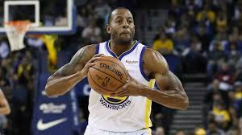

```{r setup, include=FALSE}
knitr::opts_chunk$set(echo = FALSE)
```

```{r message=FALSE, warning=FALSE}
library(dplyr)
```

```{r}
dat = read.csv(file ='../data/shots-data.csv')
```
##Golden State Warriors' shooting analysis


##Golden State Warriors' shooting analysis

In the 2016-2017 season, the Golden State Warriors have been invincible. With Kevin Durant's participation, they scored 67 wins and 15 losses in the regular season and 16 wins and 1 loss in the play offs. On June 13th, the the Golden State Warriors beat the Cleveland Cavaliers by 129-120 and won the finals by 4-1, making the Golden State Warriors the fourth most-winning team in the NBA history with a total of 5 champions.

```{r out.width='80%', echo = FALSE, fig.align='center'}
knitr::include_graphics('../images/opening.jpg')
```

The Golden State Warriors scored an average of 121.6 points in this year's grand finals, which is the fourth highest average score in the history of the NBA finals and the highest average score in the past 50 years. Here we are going to analyze the key to the Golden State Warriors' huge success: **the ability to shoot**.

####The overall statistics

```{r}
summarize(group_by(dat, team_name), two_points_perc_made = sum(shot_made_flag == 'shot_yes' & shot_type == '2PT Field Goal') / sum(shot_type == '2PT Field Goal'), three_points_perc_made = sum(shot_made_flag == 'shot_yes' & shot_type == '3PT Field Goal') / sum(shot_type == '3PT Field Goal'))
```
>The over all effective shooting percentage of the Golden State Warriors

```{r}
SP_TEAM = select(dat,shot_type, shot_made_flag, opponent)%>%
       group_by(opponent)%>%
       summarize(two_points = sum(shot_type == '2PT Field Goal'), two_points_made = sum(shot_made_flag == 'shot_yes' & shot_type == '2PT Field Goal'), three_points = sum(shot_type == '3PT Field Goal'), three_points_made = sum(shot_made_flag == 'shot_yes' & shot_type == '3PT Field Goal'))%>%
       mutate(two_points_perc_made = (two_points_made / two_points) * 100, three_points_perc_made = (three_points_made / three_points) * 100)
SP_TEAM[, c(1, 2, 3, 6, 4, 5, 7)]
```
>The effective shooting percentage of the Golden State Warriors against other teams

In the 2016-2017 season, the Golden State Warriors have a 55.3% effective 2pt-field-goal percentage, higher than all other teams in the entire season. More impressivel, their effective 2pt-field-goal percentage goes up to nearly 65% when facing teams including the Indiana Pacers and the Dallas Mavericks, which guarantees the victories against these teams.

####Individual shooting statistics
```{r out.width='80%', echo = FALSE, fig.align='center'}
knitr::include_graphics('../images/opening.JPEG')
```

The summarize of the players' shooting statistics are shown below. In the following part, e will analyze each player's shooting performance seperately.  

```{r out.width='80%', echo = FALSE, fig.align='center'}
knitr::include_graphics('../images/gsw-shot-charts.png')
```
>The shot charts of all GSW players

```{r}
SP_2 = select(dat, name, shot_type, shot_made_flag)%>%
       filter(shot_type == '2PT Field Goal')%>%
       group_by(name)%>%
       summarize(total = length(shot_type), made = length(shot_made_flag[shot_made_flag == 'shot_yes']))%>%
       mutate(perc_made = (made / total) * 100)
SP_2
```
>2PT effective shooting percentage by player

```{r}
SP_3 = select(dat, name, shot_type, shot_made_flag)%>%
       filter(shot_type == '3PT Field Goal')%>%
       group_by(name)%>%
       summarize(total = length(shot_type), made = length(shot_made_flag[shot_made_flag == 'shot_yes']))%>%
       mutate(perc_made = (made / total) * 100)
SP_3
```
>3PT effective shooting percentage by player

```{r}
SP_ALL = select(dat, name, shot_type, shot_made_flag)%>%
       group_by(name)%>%
       summarize(total = length(shot_type), made = length(shot_made_flag[shot_made_flag == 'shot_yes']))%>%
       mutate(perc_made = (made / total) * 100)
SP_ALL
```
>Effective shooting percentage by player

```{r out.width='80%', echo = FALSE, fig.align='center'}

```

The participation of Kevin Durant surely plays a significant role in the Golden State Warriors gret success. In the entire season, Durant achieved an average of 54.1% effective field-goal percentage, the highest among all Golden State Warriors' players. Durant also hits pull-up 3-pointer late in Game 3 of The Finals, helping the team finish off the Cavaliers.

```{r out.width='80%', echo = FALSE, fig.align='center'}

```

```{r}
SP_ALL = select(filter(dat, name == 'Kevin Durant'), name, shot_type, shot_made_flag)%>%
       summarize(total = length(shot_type), made = length(shot_made_flag[shot_made_flag == 'shot_yes']))%>%
       mutate(perc_made = (made / total) * 100)
SP_ALL
```
>Kevin Durant's effective field-goal percentage

```{r out.width='80%', echo = FALSE, fig.align='center'}

```

Stephen Curry continued his astonishing performance in the 2016-2017 season. Despite his overall effective field-goal-percentage being lower than Durant's, Curry managed to achieve 40.8% effective 3-points-goal-percentage among 687 attempts, proving to be a great threat for his opponents. Curry also won the Assist of the year (together with his teammate Draymond Green) by assisting Durant.

```{r}
SP_ALL = select(filter(dat, name == 'Stephen Curry'), name, shot_type, shot_made_flag)%>%
       summarize(total = length(shot_type), made = length(shot_made_flag[shot_made_flag == 'shot_yes']))%>%
       mutate(perc_made = (made / total) * 100)
SP_ALL
```
>Stephen Curry's effective field-goal percentage

```{r out.width='80%', echo = FALSE, fig.align='center'}

```

Despite his effective field-gold percentage being the lowest of the team, Draymond Green proved to be the core of the Golden States Warriors this season. He won the Defensive player of the year and the Assist of the year. He also managed to score 74 3-points for the team while focusing on the team's defence.

```{r}
SP_ALL = select(filter(dat, name == 'Draymond Green'), name, shot_type, shot_made_flag)%>%
       summarize(total = length(shot_type), made = length(shot_made_flag[shot_made_flag == 'shot_yes']))%>%
       mutate(perc_made = (made / total) * 100)
SP_ALL
```
>Draymond Green's effective field-goal percentage

```{r out.width='80%', echo = FALSE, fig.align='center'}

```

Klay Thompson scored the highest effective 3-point-field-goal percentage during the season. Among the 580 3-points attempts, he made 246 of them, proving himself to be the deadliest outer field shooting in the Golden State Warriors. His performance of scoring 60 in three quarters vs. Indiana brought him the Performance of the year, and also yet another solid victory for the Golden State Warriors.

```{r}
SP_ALL = select(filter(dat, name == 'Klay Thomspon'), name, shot_type, shot_made_flag)%>%
       summarize(total = length(shot_type), made = length(shot_made_flag[shot_made_flag == 'shot_yes']))%>%
       mutate(perc_made = (made / total) * 100)
SP_ALL
```
>Klay Thompson's effective field-goal percentage

```{r out.width='80%', echo = FALSE, fig.align='center'}

```

Comparing to his teammates, Andre Iguodala is less famous and arouse less attention. His performance, however, is also amazing with 36.2% of effective 3-pointss-field-goal percentage. He is also nominated for the Kia NBA Sixth Man Award.

```{r}
SP_ALL = select(filter(dat, name == 'Andre Iguodala'), name, shot_type, shot_made_flag)%>%
       summarize(total = length(shot_type), made = length(shot_made_flag[shot_made_flag == 'shot_yes']))%>%
       mutate(perc_made = (made / total) * 100)
SP_ALL
```
>Andre Iguodala's effective field-goal percentage

####Conclusions
In the 2016-2017 season, the Golden State Warriors performed aggresively, scoring the most points among all NBA teams. In the entire season, the excellence of the entire team produced two Assist of the years and the Performance of the year. We have reasons to believe that the team will continue to dominate the fields and score more points in the next season.

####References
[link](https://www.nba.com/nbaawards/2017/finalists)
[link](https://en.wikipedia.org/wiki/2016%E2%80%9317_NBA_season)
[link](https://www.nba.com/article/2017/12/14/one-team-one-stat-warriors-shooting-better-ever)
