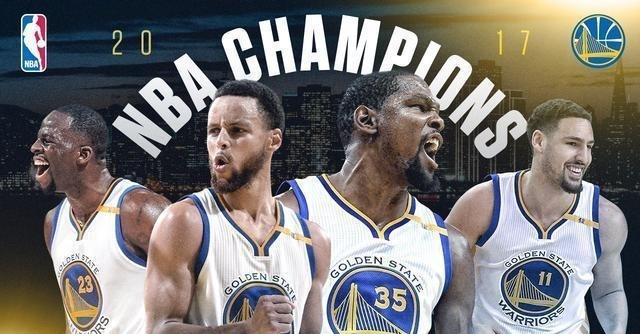

Workout 1
================
Michael Ling

Golden State Warriors' shooting analysis
----------------------------------------

Golden State Warriors' shooting analysis
----------------------------------------

In the 2016-2017 season, the Golden State Warriors have been invincible. With Kevin Durant's participation, they scored 67 wins and 15 losses in the regular season and 16 wins and 1 loss in the play offs. On June 13th, the the Golden State Warriors beat the Cleveland Cavaliers by 129-120 and won the finals by 4-1, making the Golden State Warriors the fourth most-winning team in the NBA history with a total of 5 champions.

The Golden State Warriors scored an average of 121.6 points in this year's grand finals, which is the fourth highest average score in the history of the NBA finals and the highest average score in the past 50 years. Here we are going to analyze the key to the Golden State Warriors' huge success: **the ability to shoot**.

#### The overall statistics

| team\_name            |  two\_points\_perc\_made|  three\_points\_perc\_made|
|:----------------------|------------------------:|--------------------------:|
| Golden State Warriors |                0.5528726|                  0.3949275|

| opponent               |  two\_points|  two\_points\_made|  two\_points\_perc\_made|  three\_points|  three\_points\_made|  three\_points\_perc\_made|
|:-----------------------|------------:|------------------:|------------------------:|--------------:|--------------------:|--------------------------:|
| Atlanta Hawks          |           56|                 28|                 50.00000|             63|                   24|                   38.09524|
| Boston Celtics         |           47|                 28|                 59.57447|             25|                    8|                   32.00000|
| Brooklyn Nets          |           69|                 28|                 40.57971|             56|                   20|                   35.71429|
| Charlotte Hornets      |           69|                 38|                 55.07246|             67|                   31|                   46.26866|
| Chicago Bulls          |           67|                 35|                 52.23881|             51|                   18|                   35.29412|
| Cleveland Cavaliers    |           65|                 40|                 61.53846|             62|                   24|                   38.70968|
| Dallas Mavericks       |           67|                 44|                 65.67164|             80|                   36|                   45.00000|
| Denver Nuggets         |          104|                 59|                 56.73077|             70|                   26|                   37.14286|
| Detroit Pistons        |           30|                 17|                 56.66667|             27|                   11|                   40.74074|
| Houston Rockets        |          143|                 81|                 56.64336|            128|                   44|                   34.37500|
| Indiana Pacers         |           65|                 42|                 64.61538|             52|                   20|                   38.46154|
| Los Angeles Clippers   |          143|                 84|                 58.74126|            103|                   46|                   44.66019|
| Los Angeles Lakers     |          105|                 67|                 63.80952|             85|                   27|                   31.76471|
| Memphis Grizzlies      |          122|                 67|                 54.91803|            103|                   43|                   41.74757|
| Milwaukee Bucks        |           63|                 36|                 57.14286|             52|                   23|                   44.23077|
| Minnesota Timberwolves |           98|                 53|                 54.08163|             79|                   35|                   44.30380|
| New Orleans Pelicans   |          135|                 69|                 51.11111|             90|                   36|                   40.00000|
| New York Knicks        |           62|                 29|                 46.77419|             61|                   20|                   32.78689|
| Oklahoma City Thunder  |          134|                 70|                 52.23881|            106|                   50|                   47.16981|
| Orlando Magic          |           52|                 29|                 55.76923|             52|                   23|                   44.23077|
| Philadelphia 76ers     |           79|                 36|                 45.56962|             55|                   17|                   30.90909|
| Phoenix Suns           |          107|                 57|                 53.27103|             73|                   34|                   46.57534|
| Portland Trail Blazers |          138|                 79|                 57.24638|            100|                   37|                   37.00000|
| Sacramento Kings       |          128|                 70|                 54.68750|            121|                   45|                   37.19008|
| San Antonio Spurs      |           68|                 42|                 61.76471|             47|                   17|                   36.17021|
| Toronto Raptors        |           81|                 45|                 55.55556|             55|                   25|                   45.45455|
| Utah Jazz              |           75|                 40|                 53.33333|             42|                   16|                   38.09524|
| Washington Wizards     |           30|                 15|                 50.00000|             27|                    7|                   25.92593|

In the 2016-2017 season, the Golden State Warriors have a 55.3% effective 2pt-field-goal percentage, higher than all other teams in the entire season. More impressivel, their effective 2pt-field-goal percentage goes up to nearly 65% when facing teams including the Indiana Pacers and the Dallas Mavericks, which guarantees the victories against these teams.

#### Individual shooting statistics

The summarize of the players' shooting statistics are shown below. In the following part, e will analyze each player's shooting performance seperately.

 &gt;The shot charts of all GSW players

| name           |  total|  made|  perc\_made|
|:---------------|------:|-----:|-----------:|
| Andre Iguodala |    210|   134|    63.80952|
| Draymond Green |    346|   171|    49.42197|
| Kevin Durant   |    643|   390|    60.65319|
| Klay Thompson  |    640|   329|    51.40625|
| Stephen Curry  |    563|   304|    53.99645|

| name           |  total|  made|  perc\_made|
|:---------------|------:|-----:|-----------:|
| Andre Iguodala |    161|    58|    36.02484|
| Draymond Green |    232|    74|    31.89655|
| Kevin Durant   |    272|   105|    38.60294|
| Klay Thompson  |    580|   246|    42.41379|
| Stephen Curry  |    687|   280|    40.75691|

| name           |  total|  made|  perc\_made|
|:---------------|------:|-----:|-----------:|
| Andre Iguodala |    371|   192|    51.75202|
| Draymond Green |    578|   245|    42.38754|
| Kevin Durant   |    915|   495|    54.09836|
| Klay Thompson  |   1220|   575|    47.13115|
| Stephen Curry  |   1250|   584|    46.72000|

The participation of Kevin Durant surely plays a significant role in the Golden State Warriors gret success. In the entire season, Durant achieved an average of 54.1% effective field-goal percentage, the highest among all Golden State Warriors' players. Durant also hits pull-up 3-pointer late in Game 3 of The Finals, helping the team finish off the Cavaliers.

|  total|  made|  perc\_made|
|------:|-----:|-----------:|
|    915|   495|    54.09836|

Stephen Curry continued his astonishing performance in the 2016-2017 season. Despite his overall effective field-goal-percentage being lower than Durant's, Curry managed to achieve 40.8% effective 3-points-goal-percentage among 687 attempts, proving to be a great threat for his opponents. Curry also won the Assist of the year (together with his teammate Draymond Green) by assisting Durant.

|  total|  made|  perc\_made|
|------:|-----:|-----------:|
|   1250|   584|       46.72|

Despite his effective field-gold percentage being the lowest of the team, Draymond Green proved to be the core of the Golden States Warriors this season. He won the Defensive player of the year and the Assist of the year. He also managed to score 74 3-points for the team while focusing on the team's defence.

|  total|  made|  perc\_made|
|------:|-----:|-----------:|
|    578|   245|    42.38754|

Klay Thompson scored the highest effective 3-point-field-goal percentage during the season. Among the 580 3-points attempts, he made 246 of them, proving himself to be the deadliest outer field shooting in the Golden State Warriors. His performance of scoring 60 in three quarters vs. Indiana brought him the Performance of the year, and also yet another solid victory for the Golden State Warriors.

|  total|  made|  perc\_made|
|------:|-----:|-----------:|
|      0|     0|         NaN|

Comparing to his teammates, Andre Iguodala is less famous and arouse less attention. His performance, however, is also amazing with 36.2% of effective 3-pointss-field-goal percentage. He is also nominated for the Kia NBA Sixth Man Award.

|  total|  made|  perc\_made|
|------:|-----:|-----------:|
|    371|   192|    51.75202|

#### Conclusions

In the 2016-2017 season, the Golden State Warriors performed aggresively, scoring the most points among all NBA teams. In the entire season, the excellence of the entire team produced two Assist of the years and the Performance of the year. We have reasons to believe that the team will continue to dominate the fields and score more points in the next season.

#### References

[link](https://www.nba.com/nbaawards/2017/finalists) [link](https://en.wikipedia.org/wiki/2016%E2%80%9317_NBA_season) [link](https://www.nba.com/article/2017/12/14/one-team-one-stat-warriors-shooting-better-ever)
